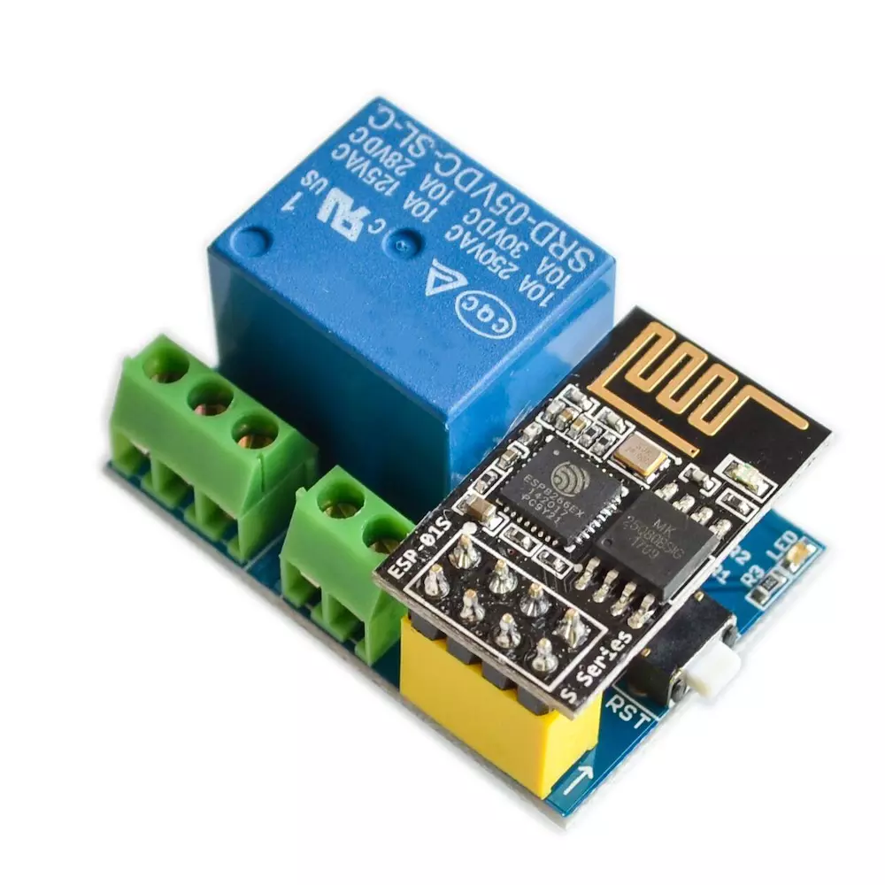
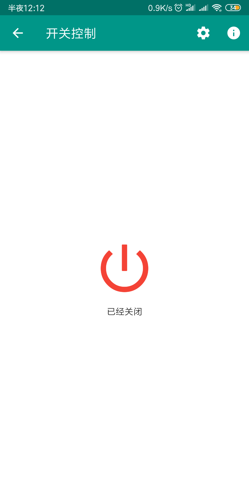
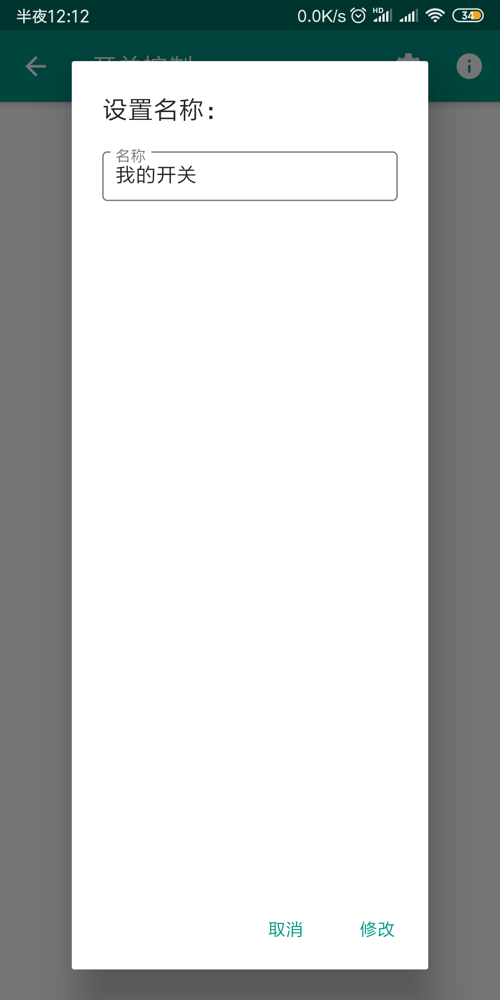
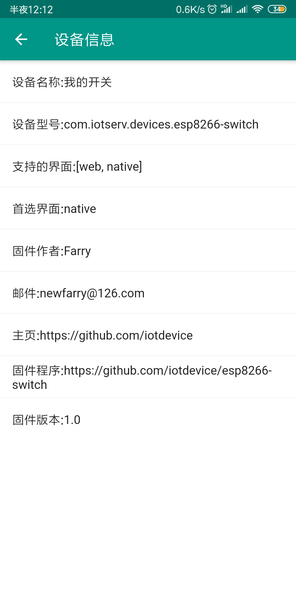

# esp8266-switch
开源的esp8266远程开关固件
> ## control with app(使用一下app操控)：
> * https://github.com/nat-cloud/android-explorer
> * 此程序会自动发现设备，将设备放入智能设备列表

#### 支持的功能：
- [x] 1.支持设备开关
- [x] 2.支持设备重新命名

#### 项目使用的硬件  
  * esp01-relay  
  

#### 界面
  * 主界面

  * 重新命名

  * 设备详情
